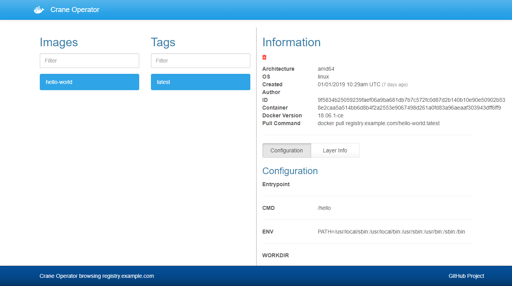

Docker Registry Sample
======================

Sample of private Docker registry with basic authentication and UI by self-signed certificate

Requirement
-----------

Docker and Docker Compose

How to run your private Docker registry
---------------------------------------

Edit sample.env and rename it to .env. Then, execute the following commands.

```console
make configure
make start
```

Using your private Docker registry from client
----------------------------------------------

Connect to your Docker registry from the client referring to the following.

```console
registry_host=registry.example.com
registry_owner=registry
registry_home=/home/registry

sudo scp "${registry_owner}@${registry_host}:${registry_home}/certs/ca.crt" "/etc/pki/ca-trust/source/anchors/${registry_host}.crt"
sudo update-ca-trust
sudo systemctl restart docker
docker login ${registry_host}
```

Pull the example image from the Docker Hub registry and push it to your private Docker registry.

```console
docker pull hello-world:latest
docker tag hello-world:latest ${registry_host}/hello-world:latest
docker push ${registry_host}/hello-world:latest
```

Web UI
------

The registry UI is reachable http://localhost:8000/




Author
------

[Shinichi Akiyama](https://github.com/shakiyam)

License
-------

[MIT License](https://opensource.org/licenses/MIT)
